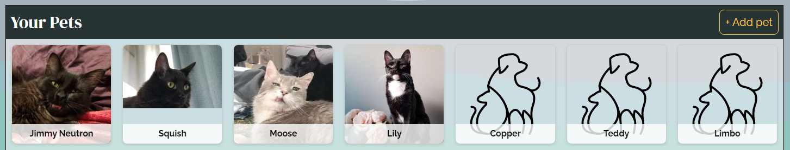
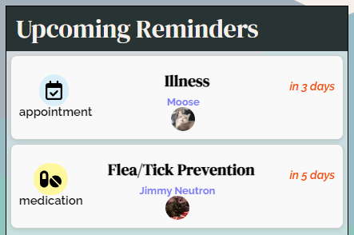
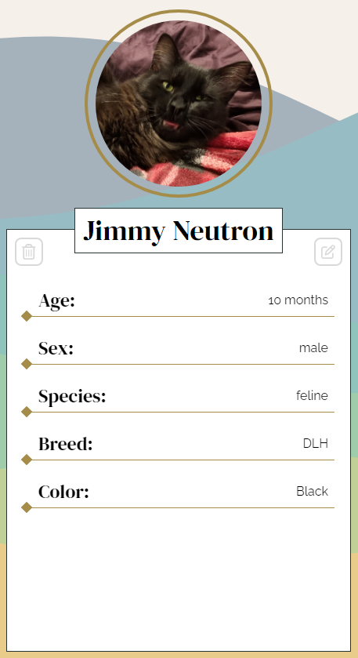
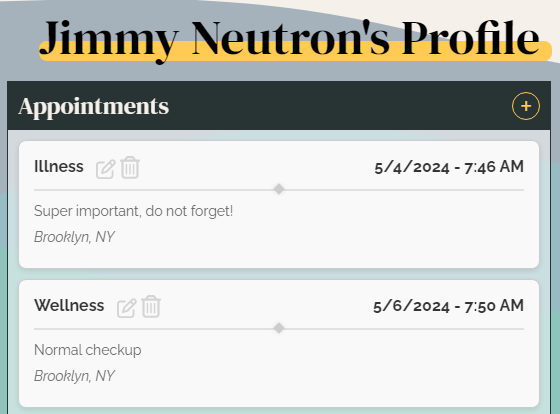

🐾 [Live Demo](https://mern-pet-portal-4c9fd5ba0b2f.herokuapp.com/)
## Background and Overview
Pet Portal is a web application designed to simplify pet care management for pet owners. With Pet Portal, users can create profiles for their pets, track their health records, and set reminders for important events like vaccinations, preventatives, and appointments. The platform aims to streamline the pet care process, providing users with a centralized hub for managing some common aspects of their pets' health.

## Current Features:
1. **JWT-based User Authentication:**

- Users must log in to access the Pet Portal platform.

- 🔑*There is a demo user available to try out these features!*
- The session will auto-refresh as it nears its expiration, but if unsuccessful or if expiration happens while the app is not loaded, will prompt the user to log in and refresh their session.

2. **Pets:** *(CRUD feature)* 
- **Dashboard** The dashboard serves as the central hub for users to manage their pets and appointments. It displays an index of the user's pets along with any upcoming reminders or events, such as vaccinations, labwork, and vet appointments. Users can add new pets to their dashboard and upload a profile photo. From here, users can navigate to their individual pets' profiles to view/edit detailed information. </br>

</br>
- **Pet Profiles**
- Users can view individual pet summaries on their pets' profiles, including physical characteristics and microchip/insurance information. 
- Profiles also house reminder modules that categorize reminders by type and display details for vaccines, medications, and appointments. 

- Users may edit or delete their pet's profiles from here as well. </br>


</br>
3. **Reminders:** *(CRUD feature)* 
- This module provides a user-friendly interface for adding, editing, and deleting reminders. 
- Reminders can be made under several categories, including appointments/procedures, vaccines, and preventatives, and render details specific to each type of reminder.
- Vaccines that are due in < 2 months have a yellow indicator, green if due in > 2 months, and red if overdue.
- Users can set reminders for specific dates and times, as well as assign reminders to individual pets.</br>
 </br>
4. **RESTful, user-friendly Express routing:**
- This app utilizes the power and flexibility of Express.js, with the ability to add fully customizable middleware for defining endpoint behavior & robust error handling to any route, while keeping it organized and user-friendly by adopting a Model-View-Controller (MVC) pattern.
- This pattern makes it easy to collaborate with the front end to add or change routes and behaviors as the need arises.

```js
const reminderRouter = Router()

reminderRouter.get('/user/:id', ReminderController.indexByUser)
reminderRouter.get('/pet/:id', ReminderController.indexByPet)
reminderRouter.get('/:id', ReminderController.show)
reminderRouter.post('/', requireUser, ReminderController.create)
reminderRouter.put('/:id', requireUser, ReminderController.update)
reminderRouter.delete('/:id', requireUser, ReminderController.delete)
```
## Technologies
**Front End**
- 


**Back end**
- 


**Cloud**
  - 
## Development Team and Work Breakdown
[Andrea Cheung](https://github.com/acheung-94) - Frontend flex | [Christopher J. Trent](https://github.com/ChristopherJTrent) - Backend Lead | [Sam Kim](https://github.com/sam-kim99) - Backend flex | [SoHyun Jang](https://github.com/shjang1025) - Frontend Lead

1. **Day 1 - User Auth and Project Setup**
- User Auth
  - MongoDB & repo setup - Andrea
  - ESLint config - Chris
- Project breakdown, assign tasks, set up PM 
  - backend User auth - Chris & Sam
  - frontend User auth - set up redux store for auth - Andrea & Jenny

2. **Day 2 - Pet Profiles**
- Backend CRUD API endpoints for Pets and their reminders - Chris & Sam
- Frontend components for pet profile page, +/- data vis implementation - Andrea & Jenny

3. **Day 3 - Reminders**
- Backend CRUD API endpoints for reminders - Chris & Sam
- Front end dashboard components to access Reminder module for creating/editing reminders. - Andrea & Jenny

4. **Day 4 - Reminders, continued**
- continue coordination with backend for access/formatting of documents for reminders, run integration tests along the way.

5. **Day 5 - Polishing**
-  UI/UX improvements, code optimization, debugging
- develop plans for Yelp API for a potential Find A Vet feature. 

6. **Day 6 - Deployment & bugfixes**
- Assess for smooth interactions and flow, accurate and reliable data served from backend in production environment, etc.
- Heroku deployment, allow time to debug potential production bugs.

### What's next?
1. **User Profiles & Add Labwork Module**
- Create a user preview section in the dashboard with options to edit or delete account.
- implement email verification

2. **Find A Vet Module**
- Integrate Yelp API to help users to find a vet for their pets!
- Create a display section to show a list of the user's vets & their contact information.

3. **Pet Metrics**
- Add document to database that holds a pet's previous weights and the dates they were update on.
- Render a line plot to display the changes in a pet's weight over time. 

4. **Vet Document Storage and CloudVision assisted reminders**
- Integrate Google CloudVision to use OCR on uploaded veterinary documents (invoices, medical notes, etc) to generate text.
- Parse results, display them on a form for the user to verify correct values, and then send it to the database as a reminder.